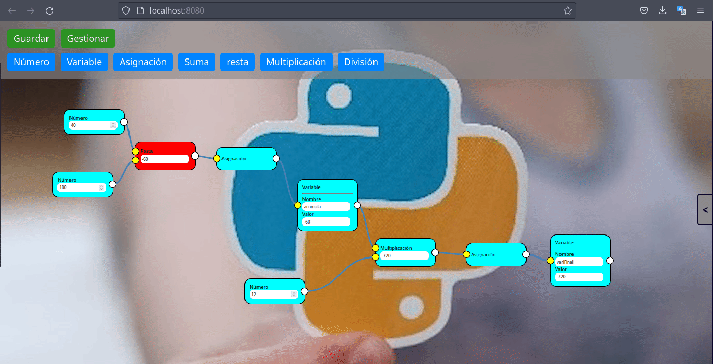

# developer-nodes



## Project setup
`
npm install
`

### Compiles and hot-reloads for development
``
npm run serve
``

### Compiles and minifies for production
````
npm run build
````

### Lints and fixes files
```
npm run lint
```

## Example code
```java
    package com.exampel.app;

    public static void main( String[] args){
        System.out.println("pintelas pa");
    }
```


### Customize configuration
See [DEMO](http://localhost:3000).


use
[AllowContentEncoding]

defin
[AllowContentEncoding]: https://pkg.go.dev/github.com/go-chi/chi/middleware#AllowContentEncoding

