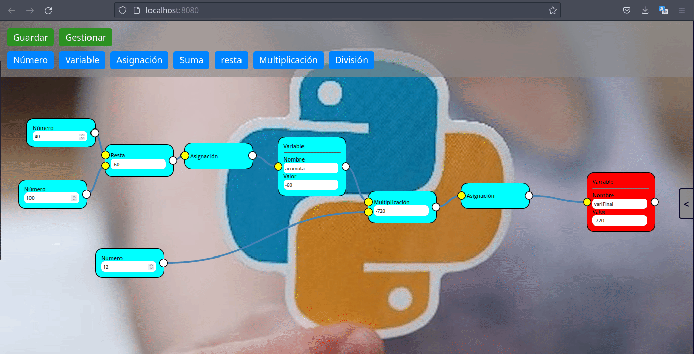

# developer-nodes




## Install dependencies

```
npm i
```
### or

```
yarn
```

## Run in development
```
npm run serve
```
### or

```
yarn serve
```


## Compiles and minifies for production
````
npm run build
````

### or

```
yarn build
```

## Lints and fixes files
```
npm run lint
```
### or

```
yarn lint
```

## see in production
**[DEMO](http://localhost:3000).**